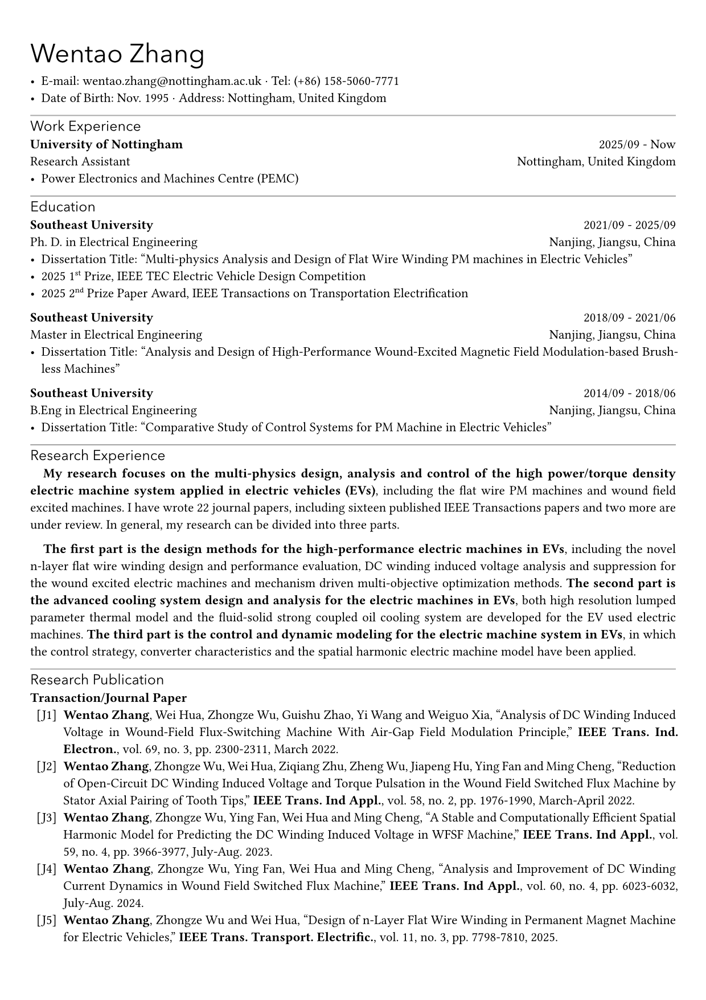

# Wentao Zhang — CV

My personal CV, built with the [Chi CV Typst template](https://github.com/matchy233/typst-chi-cv-template) by [matchy233](https://github.com/matchy233) (a rip-off of [skyzh's CV](https://github.com/skyzh/cv), using [Typst](https://typst.app/)).

## Preview



[📄 Download PDF](resume_v4.pdf)

## Build

Requires [Typst](https://typst.app/) CLI.

```bash
typst compile --font-path ./fonts resume_v4.typ resume_v4.pdf
```

## Template Credit

This CV uses the **Chi CV** Typst template by [matchy233](https://github.com/matchy233/typst-chi-cv-template).

`fonts/FontAwesome6.otf` is generated by merging `Font Awesome 6 Free-Solid-900.otf` and `Font Awesome 6 Brands-Regular-400.otf` using [fontforge](https://fontforge.org/en-US/). Original Font Awesome fonts were downloaded from [here (Desktop version)](https://fontawesome.com/download) (6.0.4 as of 2023/04/01).

⚠️ The implementation of `fontawesome.typ` is far from perfect and **may** conflict with existing `typst` built-in commands.
